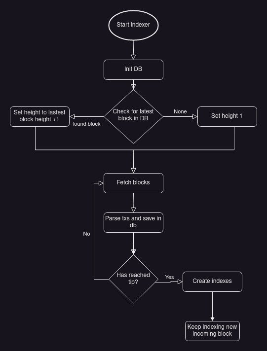

# Indexer

The indexer is written in Rust and store blocks and transaction to a PostgreSQL database. It requires to have access to a Namada node through its RPC enpoints.

## Configuration

The indexer must have the following configuration:

Settings.toml
```toml
# Level of logging in the indexer
log_level = "info"
network = "public-testnet-15" # IMPORANT! Do not use `.` just put the name of the network and don't have the hash (e.g 'shielded-expedition.b40d8e9055' becomes 'shielded-expedition')

# Connection information for the PostgreSQL database
[database]
host = "localhost"
user = "postgres"
password = "wow"
dbname = "blockchain"
create_index = true

# The tendermint RPC address and port to access the Namada node
[indexer]
tendermint_addr = "http://127.0.0.1:26657"
```

In option it is possible to activate the `prometheus` feature or `jeager` for a better view of the indexer performances. See [telemetry](./telemetry.md)

## Starting the indexer

In order to start the indexer we will need to pass the configuration file path to the environement variable `INDEXER_CONFIG_PATH`.

```
$ INDEXER_CONFIG_PATH="${PWD}/config/Settings.toml" ./indexer
```

## Postgres tables

The tables are automatically created by the indexer if they don't exist.
```sql
            List of relations
 Schema |     Name     | Type  |  Owner   
--------+--------------+-------+----------
 public | blocks       | table | postgres
 public | evidences    | table | postgres
 public | transactions | table | postgres
 public | tx_bond      | table | postgres
 public | tx_transfer  | table | postgres
```

Once the indexer has done the initial syncing it will automatically create indexes to make retrieving data from the server faster.

### Blocks

This table contains all the information found in a block and also the commit information. The evidences link to a block can be found in another table `evidences`.

```
\d blocks

                               Table "public.blocks"
                 Column                  |  Type   | Collation | Nullable | Default 
-----------------------------------------+---------+-----------+----------+---------
 block_id                                | bytea   |           | not null | 
 header_version_app                      | integer |           | not null | 
 header_version_block                    | integer |           | not null | 
 header_chain_id                         | text    |           | not null | 
 header_height                           | integer |           | not null | 
 header_time                             | text    |           | not null | 
 header_last_block_id_hash               | bytea   |           |          | 
 header_last_block_id_parts_header_total | integer |           |          | 
 header_last_block_id_parts_header_hash  | bytea   |           |          | 
 header_last_commit_hash                 | bytea   |           |          | 
 header_data_hash                        | bytea   |           |          | 
 header_validators_hash                  | bytea   |           | not null | 
 header_next_validators_hash             | bytea   |           | not null | 
 header_consensus_hash                   | bytea   |           | not null | 
 header_app_hash                         | text    |           | not null | 
 header_last_results_hash                | bytea   |           |          | 
 header_evidence_hash                    | bytea   |           |          | 
 header_proposer_address                 | text    |           | not null | 
 commit_height                           | integer |           |          | 
 commit_round                            | integer |           |          | 
 commit_block_id_hash                    | bytea   |           |          | 
 commit_block_id_parts_header_total      | integer |           |          | 
 commit_block_id_parts_header_hash       | bytea   |           |          | 
Indexes:
    "pk_block_id" PRIMARY KEY, btree (block_id)
    "ux_header_height" UNIQUE, btree (header_height)
Referenced by:
    TABLE "transactions" CONSTRAINT "fk_block_id" FOREIGN KEY (block_id) REFERENCES blocks(block_id)
```

### Transactions

The `transactions` table contains all the transactions that either encrypted or decrypted (defined by the `tx_type`). The decrypted raw data can then be find under `data` and its corresponding `code` value can be used for decoding the transactions on the server side.

NOTE: it doesn't seem to be worth storing the encrypted data as no computation can be done over it. If a specific use case is mentioned it can be added.

```
\d transactions

            Table "public.transactions"
  Column  | Type  | Collation | Nullable | Default 
----------+-------+-----------+----------+---------
 hash     | bytea |           | not null | 
 block_id | bytea |           | not null | 
 tx_type  | text  |           | not null | 
 code     | bytea |           |          | 
 data     | bytea |           |          | 
Indexes:
    "pk_hash" PRIMARY KEY, btree (hash)
Foreign-key constraints:
    "fk_block_id" FOREIGN KEY (block_id) REFERENCES blocks(block_id)

```

### Evidences

The `evidences` table contains the evidences of validators misbehavior. Only one evidence is being used in Namada : Duplicate Vote Evidence.

```
\d evidences

                   Table "public.evidences"
       Column       |  Type   | Collation | Nullable | Default 
--------------------+---------+-----------+----------+---------
 block_id           | bytea   |           | not null | 
 height             | integer |           |          | 
 time               | text    |           |          | 
 address            | bytea   |           |          | 
 total_voting_power | integer |           | not null | 
 validator_power    | integer |           | not null | 
```

### Tx Transfer

The `tx_transfer` table contains all the transfer transaction decoded. It allows to identify the shielded and not shielded transactions. It is redundant with the raw transaction saved in the `transactions` table.

```
\d tx_transfer

            Table "public.tx_transfer"
  Column  | Type  | Collation | Nullable | Default 
----------+-------+-----------+----------+---------
 tx_id    | bytea |           | not null | 
 source   | text  |           | not null | 
 target   | text  |           | not null | 
 token    | text  |           | not null | 
 amount   | text  |           | not null | 
 key      | text  |           |          | 
 shielded | bytea |           |          | 
Indexes:
    "pk_tx_id_transfer" PRIMARY KEY, btree (tx_id)
    "x_source_transfer" hash (source)
    "x_target_transfer" hash (target)
```

### Tx Bond

The `tx_bond` table contains the decoded informations for the bond transactions.

```
\d tx_bond

                Table "public.tx_bond"
  Column   |  Type   | Collation | Nullable | Default 
-----------+---------+-----------+----------+---------
 tx_id     | bytea   |           | not null | 
 validator | text    |           | not null | 
 amount    | text    |           | not null | 
 source    | text    |           |          | 
 bond      | boolean |           | not null | 
Indexes:
    "pk_tx_id_bond" PRIMARY KEY, btree (tx_id)
    "x_source_bond" hash (source)
    "x_validator_bond" hash (validator)

```


## Indexer logic



